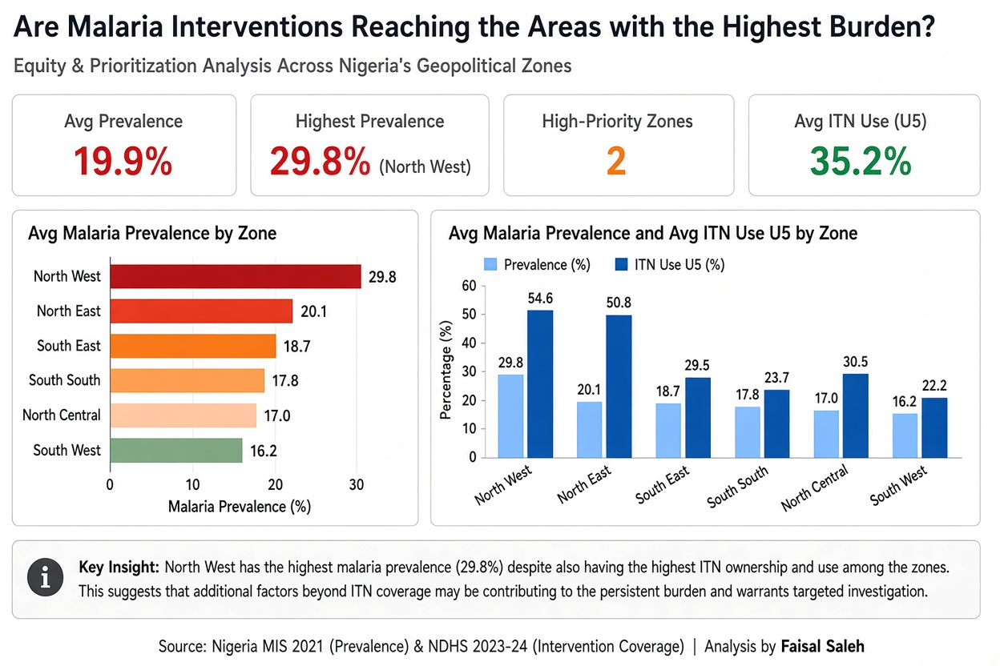

# Nigeria Malaria Equity Analysis

**Are Malaria Interventions Reaching the Areas with the Highest Burden?**  
An Equity and Prioritization Analysis Across Nigeria’s Geopolitical Zones

---

### Project Overview

This project examines the relationship between malaria burden and intervention coverage across Nigeria’s six geopolitical zones. The goal is to identify which zones should be prioritized for targeted malaria control efforts.

**Guiding Question:**  
Which geopolitical zones should malaria programs prioritize for maximum impact with limited resources?

---

### Key Findings

- **North West** recorded the highest malaria prevalence at **29.8%**.
- North West also had the highest ITN ownership (75.8%) and highest ITN use among children under five (54.6%).
- Despite strong intervention coverage, North West continues to carry the highest burden.
- **North East** is the second highest priority zone (20.1% prevalence).
- **South East** recorded the highest IPTp 3+ coverage (41.2%).
- South South and South West recorded the lowest ITN use among children under five.

---

### Methodology

**Data Sources:**
- Nigeria Malaria Indicator Survey (NMIS) 2021
- Nigeria Demographic and Health Survey (NDHS) 2023–24

**Indicators Used:**
- Malaria prevalence (children 6–59 months)
- ITN ownership
- ITN use among children under 5
- ITN use among pregnant women
- IPTp 3+ coverage

**Approach:**
- Compared burden vs coverage across geopolitical zones
- Ranked zones by prevalence
- Classified zones into High, Moderate, and Lower priority categories
- Built an interactive Power BI dashboard for decision support

**Tools:**
- Microsoft Excel
- Power BI

---

### Dashboard Preview

---

### Project Structure
Nigeria_Malaria_Equity_Analysis
├── Dashboard_Images/
├── Documentation/
├── ExtractedData/
├── PowerBI/
└── Source/

---

### Recommendations

1. Prioritize **North West** for intensified surveillance and complementary interventions.
2. Investigate reasons for persistent high burden despite strong ITN coverage.
3. Strengthen ITN utilization campaigns in South South and South West.
4. Document and learn from higher IPTp performance in the South East.
5. Adopt prevalence-driven prioritization when allocating limited resources.

---

### Author

**Faisal Saleh**  
Medical Student | Healthcare Data Analytics  

---

### Source

Nigeria MIS 2021 (Prevalence) & NDHS 2023-24 (Intervention Coverage)
